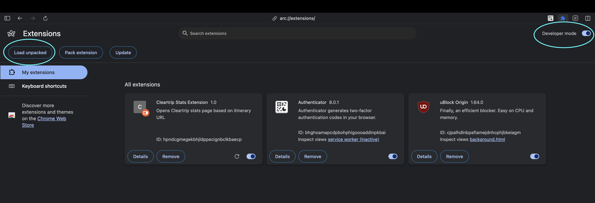

# Cleartrip/Flyin Stats Extension

A Chrome extension that helps you quickly access Cleartrip stats pages from itinerary pages. This extension streamlines your workflow by providing instant access to stats pages directly from your Cleartrip itinerary pages.

## Features
<<<<<<< HEAD
=======
- Automatically detects Cleartrip itinerary pages
- Opens stats pages based on the current domain (www.cleartrip.ae or me.cleartrip.ae)
- Simple one-click interface
>>>>>>> dc1a014da5f1ad98cd985229eb0a28f6aba88e12

- 🚀 **Automatic Detection**: Automatically detects Cleartrip itinerary pages
- 🌐 **Domain-Specific Routing**: Opens stats pages based on your current domain (www.cleartrip or me.cleartrip)
- 🎯 **One-Click Interface**: Simple and intuitive interface for quick access
- 🔐 **Secure**: No data collection or tracking

<<<<<<< HEAD
## Installation Guide

### Prerequisites
- Google Chrome browser (latest version recommended)
- Cleartrip account access

### Step-by-Step Installation

1. **Clone the Repository**
   ```bash
   git clone git@bitbucket.org:me-cleartrip/air-supplier-commons.git
   git checkout stats_ui_extension
   ```

2. **Enable Developer Mode**
   - Open Chrome browser
   - Navigate to `chrome://extensions/`
   - Toggle on "Developer mode" in the top right corner

3. **Load the Extension**
   - Click "Load unpacked" button
   - Select the extension directory from your cloned repository

## Usage Instructions

1. **Access the Extension**
   - Look for the extension icon in your Chrome toolbar
   - Click the icon to open the extension popup

2. **Navigate to Stats Page**
   - Click the "Go to Stats Page" button
   - The extension will automatically open the appropriate stats page based on your current domain
   
   
   

## Troubleshooting

- If the extension icon doesn't appear, make sure Developer mode is enabled in Chrome extensions
- If the extension doesn't work on a specific page, ensure you're on a valid Cleartrip itinerary page
- If you encounter any issues, check the browser console for error messages

## Support

For any questions or issues, please reach out to  @aryan.bahl@flyin.com

## Contributing

1. Fork the repository
2. Create your feature branch (`git checkout -b feature/stats-extension-${jira_ticket_id}`)
3. Commit your changes (`git commit -m '${message}'`)
4. Push to the branch (`git push`)
5. Open a Pull Request to stats_ui_extension
---

⭐️ If you find this extension useful, please consider starring the repository!
=======
## Usage
1. Click the extension icon in your Chrome toolbar
2. Click "Go to Stats Page" button
3. The extension will open the appropriate stats page based on your current domain
4. Additionally, you can enter the itinerary id or trip id in the input box to open the respective stats page.
>>>>>>> dc1a014da5f1ad98cd985229eb0a28f6aba88e12
